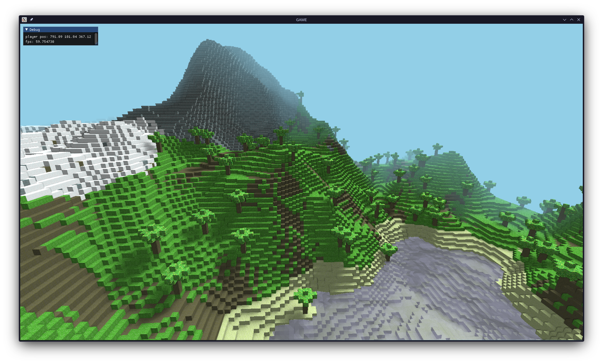

# Voxel Engine

A Minecraft-like voxel engine made in C++ and OpenGL with the custom **Omega** engine.

Some features include:

- deferred renderer with shadow maps for lighting
- infinite/dynamic world generation
- dynamic water shaders
- biomes
- day/night cycles
- world chunk caching and management

