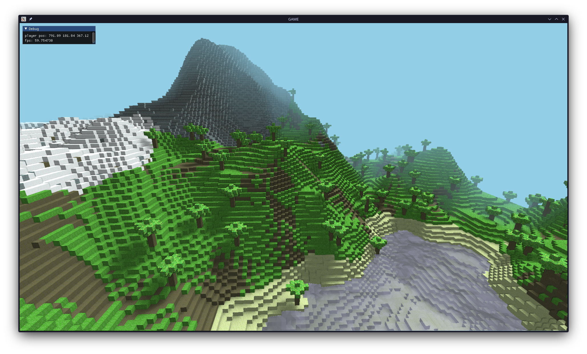

# Voxel Engine

A Minecraft-like voxel engine made in C++ and OpenGL with the custom **Omega** engine.

Some features include:

- deferred renderer with shadow maps for lighting
- infinite/dynamic world generation
- dynamic water shaders
- biomes
- day/night cycles
- world chunk caching and management



## Building

Clone this and its submodules.

### Build the Omega Engine

First, build the **Omega** engine library.

```
cd lib/omega/
./configure.sh
./build.sh
```

### Build the App

Navigate back to the project root.
`./run.sh` builds and runs the program. The binary is located in `build/voxel`.

Use the WASD keys to navigate around the world.
